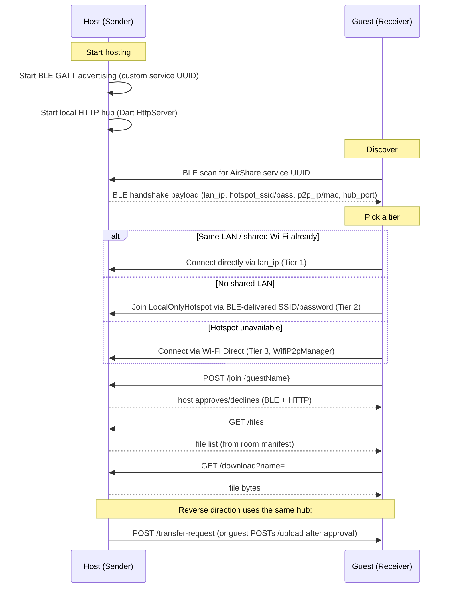

# AirShare

**Air it. Share it.**

AirShare is a cross-platform, serverless file-sharing app. Two devices find each other over Bluetooth Low Energy, negotiate the fastest available local link, and transfer files directly — no accounts, no internet, no cables.

[]()
[]()
[]()
<!-- TODO: add a license badge once a LICENSE is chosen -->

## Features

- **BLE discovery & handshake** — devices advertise and scan for a dedicated AirShare GATT service (`lib/ble_transport.dart`, `lib/air_share_constants.dart`); the host's GATT server exchanges a JSON handshake payload describing every connection tier it can offer.
- **Multi-tier connection fallback** — automatically prefers an existing shared LAN/Wi-Fi, then falls back to an Android `LocalOnlyHotspot`, then to Wi-Fi Direct (`WifiP2pManager`) as a last resort (`lib/connection_tier.dart`, `lib/host_network_tier.dart`, `lib/wifi_tier_prerequisites.dart`).
- **Host/guest approval flow** — joining a session and starting a transfer both require explicit host approval, driven over BLE and confirmed over HTTP (`lib/local_hub_runtime.dart`).
- **Local HTTP file hub** — once connected, the host runs a local `HttpServer` exposing `/files`, `/upload`, `/download`, and `/files` (DELETE) endpoints; only approved guests can hit them.
- **Per-file ownership** — the hub tracks who shared each file in a small JSON manifest, so only the uploader (or the host) can delete a file (`lib/shared_room_manifest.dart`).
- **Optional connection PIN** and device display-name branding, configurable in Settings (`lib/settings_page.dart`, `lib/device_branding.dart`).
- **In-app connection log / diagnostics viewer** for debugging handshakes and transfers (`lib/connection_logger.dart`, `lib/handshake_trace.dart`).

## Architecture

Discovery and control happen over BLE; bulk file transfer happens over HTTP once a network tier is established.



Tier selection logic lives in [`connection_tier.dart`](lib/connection_tier.dart) (same-subnet checks) and [`host_network_tier.dart`](lib/host_network_tier.dart) (interface scoring/exclusion — cellular, VPN, USB tether interfaces are never advertised as the hub IP). Android-side BLE GATT server/client, `LocalOnlyHotspot`, and `WifiP2pManager` logic live in [`MainActivity.kt`](android/app/src/main/kotlin/com/example/air_share/MainActivity.kt); the Windows BLE native layer lives in [`flutter_window.cpp`](windows/runner/flutter_window.cpp).

## Tech stack

From [`pubspec.yaml`](pubspec.yaml):

| Package | Purpose |
|---|---|
| `flutter` | UI framework |
| `device_info_plus` | Device metadata for branding/identity |
| `geolocator` | Location permission/services (required by Android for Wi-Fi scan/connect APIs) |
| `network_info_plus` | Local Wi-Fi IP/interface info |
| `nsd`, `multicast_dns` | Network service discovery / mDNS |
| `http` | HTTP client for the file-transfer hub |
| `mime` | MIME type detection for shared files |
| `shared_preferences` | Local settings persistence (device name, PIN) |
| `path_provider`, `path` | Filesystem paths for shared/received files |
| `file_picker` | Picking files to send |
| `permission_handler` | Runtime permission requests |
| `open_filex` | Opening received files in other apps |

Native platform layers (not in `pubspec.yaml`): Kotlin on Android (BLE GATT server/client, `LocalOnlyHotspot`, Wi-Fi Direct), C++ on Windows (BLE via the Windows Runtime, in `windows/runner`).

## Getting Started

### Prerequisites

- Flutter SDK with Dart `^3.11.1` (per `pubspec.yaml`'s `environment.sdk`).
- **Android:** JDK 17 (`sourceCompatibility`/`targetCompatibility` = Java 17 in [`android/app/build.gradle.kts`](android/app/build.gradle.kts)). `compileSdk`, `minSdk`, `targetSdk`, and NDK version are **not pinned in this repo** — they come from the Flutter tool's defaults (`flutter.compileSdkVersion` / `flutter.minSdkVersion` / `flutter.ndkVersion`). For the Flutter SDK checked out in this environment, those resolve to `compileSdk = 36`, `minSdk = 24`, `targetSdk = 36`, `ndkVersion = 28.2.13676358` — but these will change if you build with a different Flutter version.
- **Windows:** CMake ≥ 3.14 and a C++17-capable MSVC toolchain (Visual Studio), per [`windows/CMakeLists.txt`](windows/CMakeLists.txt).
- **iOS:** planned; no verified build requirements yet. <!-- TODO -->

### Run

```bash
flutter pub get
flutter run            # pick a connected device/emulator
```

### Build

```bash
flutter build apk      # Android
flutter build windows  # Windows
```

## Usage

1. **Host a session** — on one device, choose to send/host. The app starts BLE advertising and the local HTTP hub ([`sender_staging_page.dart`](lib/sender_staging_page.dart)).
2. **Discover** — on the other device, choose to receive. The app scans for the AirShare BLE service UUID and lists nearby hosts ([`discovery_page.dart`](lib/discovery_page.dart)).
3. **Connect** — the guest picks a host; the app reads the BLE handshake payload and automatically picks the best tier: same-LAN, then `LocalOnlyHotspot` (with an in-app SSID/password prompt if auto-join isn't possible), then Wi-Fi Direct.
4. **Join approval** — the guest requests to join; the host approves or declines from the app UI.
5. **Transfer** — once joined, either side can browse/download shared files (`GET /files`, `GET /download`) or push new ones, which require the receiving side's approval before upload proceeds.

## Project structure

```
lib/                          Flutter app: UI, BLE transport client, connection-tier logic, local HTTP hub
android/app/.../MainActivity.kt   Native Android BLE GATT server/client, LocalOnlyHotspot, Wi-Fi Direct
windows/runner/flutter_window.cpp Native Windows BLE layer
ios/, macos/, linux/, web/    Platform scaffolding generated by Flutter (iOS support is in progress)
engine/                       Legacy/experimental Go prototype of a file-serving hub (mDNS + HTTP).
                               Not wired into the current Flutter app — no code launches it.
                               Kept for reference only.
```

## Roadmap

- iOS support — some `Platform.isIOS` branches exist in the BLE transport layer, but the platform is not fully built out yet.
- Status of the `engine/` Go prototype is undecided (legacy/reference only for now).
- <!-- TODO: add any other planned work here -->

## Repository

<https://github.com/OfirAdmoni/AirShare/tree/main>
